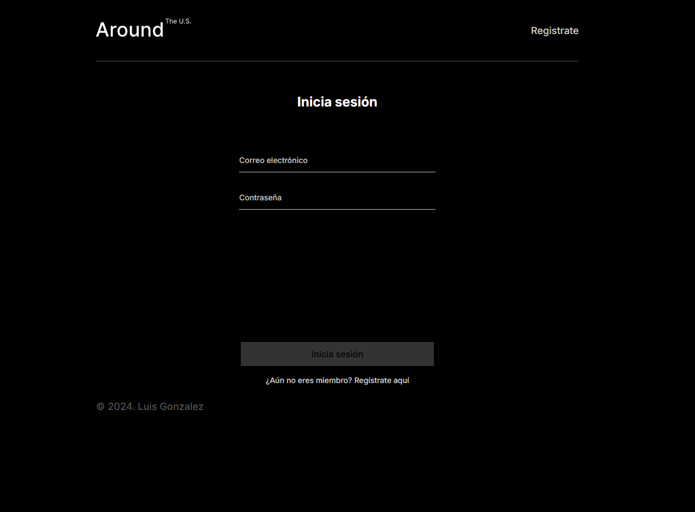
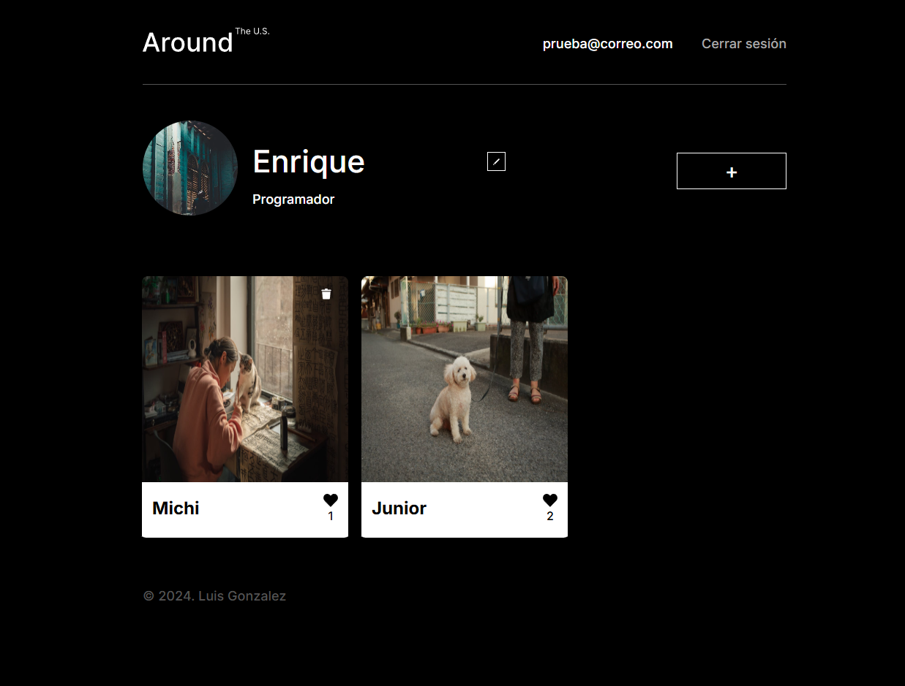

# Tripleten Web Project API Full

Este proyecto fue desarrollado como parte del bootcamp de desarrollo web de **Tripleten**, utilizando **HTML**, **CSS**, **JavaScript**, **React**, **Vite** y **Google Cloud**. El código fue trabajado en **Visual Studio Code**.

## ¿De qué se trata?

Este proyecto consiste en la creación de una API RESTful para gestionar la autenticación, autorización y manejo de usuarios en una aplicación web. La aplicación está construida utilizando Node.js para el back-end y React para el front-end.

## Resoluciones compatibles:

El proyecto está optimizado para las siguientes resoluciones:

1. **1280px** - Desktop
2. **800px** - Tablet
3. **320px** - Mobile

## Vista previa del proyecto:

## Aprendizajes:

- **Protección de información:** Implementación de hash para contraseñas antes de guardarlas en la base de datos.
- **Controladores:** Implementación de controladores `login` y `register`, que emplean JWT.
- **Middleware de autorización:** Verificación de la presencia de un JWT en `local storage`, devolviendo error 403 (Forbidden) en caso de ausencia.
- **Manejo central de errores:** Implementación de un sistema centralizado para la gestión de errores.
- **Validación de datos:** Validación de datos entrantes al servidor mediante **Joi** y **Celebrate**.
- **CORS:** Configuración de solicitudes de dominio cruzado y tecnología **CORS**.
- **Registros:** Configuración de registros (logs) mediante **Winston**. (El archivo .log no se subió al repositorio).

## Despliegue:

Despliegue en una máquina virtual de **Google Cloud**, configurando:

- **Gestor de procesos PM2**
- **Registro de dominio en FreeDNS**
- **Servidor HTTP proxy reverso con NGINX**
- **Protocolo HTTPS mediante Certbot**

## Detalles del código:

El proyecto está estructurado en componentes de **React**. A continuación, se describen las partes más relevantes:

### Estructura de componentes:

- **Login:** Componente encargado de gestionar la conexión con la API para autenticar al usuario, así como almacenar el JWT en el navegador.
- **Register:** Componente que maneja el registro de usuarios a través de la API.
- **Auth:** Middleware que revisa la presencia de un JWT y proporciona permisos para acceder a rutas protegidas.

### Nuevas implementaciones:

- **Protección de información:** Implementación de hash para contraseñas.
- **Controladores:** Controladores `login` y `register` con JWT.
- **Middleware de autorización:** Verificación de JWT en `local storage`, devolviendo error 403 (Forbidden) en caso de ausencia.
- **Manejo central de errores:** Sistema centralizado para la gestión de errores.
- **Validación de datos:** Validación de datos entrantes mediante **Joi** y **Celebrate**.
- **CORS:** Configuración de solicitudes de dominio cruzado.
- **Registros:** Configuración de logs mediante **Winston** (el archivo .log no se subió al repositorio).

## Link de GitHub Pages para visualizar mi página:

[http://www.triparound.mooo.com/](https://www.triparound.mooo.com/)

**Nota:** Este link es temporal ya que se está utilizando el periodo de prueba de Google Cloud. Cuando ya no esté disponible, pueden visualizar el funcionamiento de la página en este video.

---

# © Luis González

Espero que disfruten de este proyecto tanto como disfruté realizándolo. ¡Saludos!
